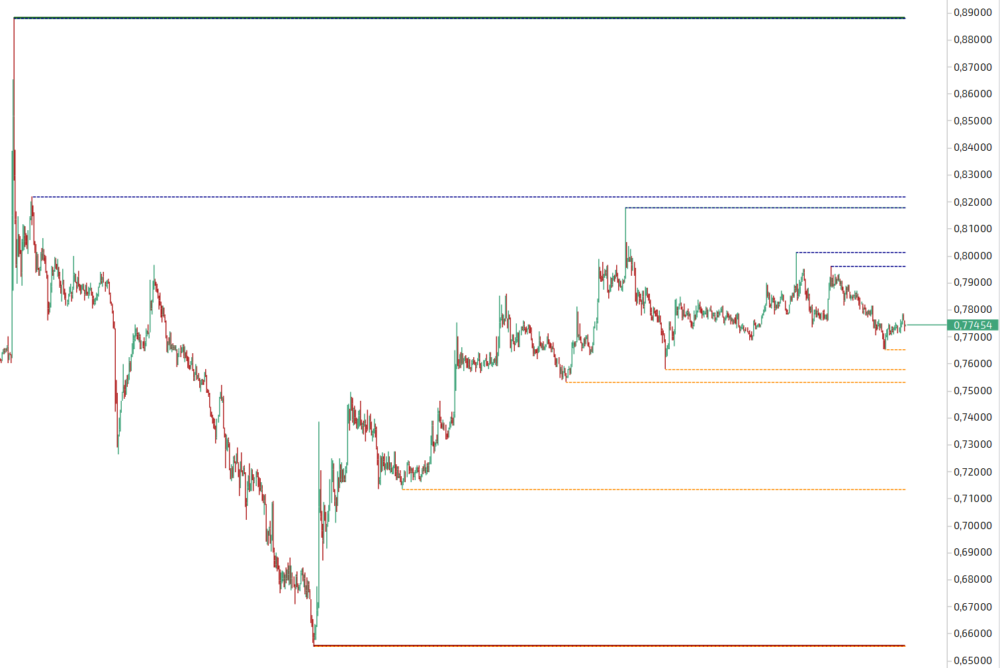

# Akode TigerTrade Indicators

[](LICENSE)
[](https://dotnet.microsoft.com/)
[](https://www.tiger.com/terminal)

Open-source TigerTrade custom indicators repository.

This package is designed as a collection of indicators and will expand over time.

## Indicators

### Akode Levels (`AkodeLevelsIndicator`)

Pivot-based support/resistance level detector.

It detects pivot highs/lows and draws horizontal support and resistance levels.
It supports aggregation to higher intervals, tracks broken levels, and limits visible active/broken lines independently for highs and lows.

#### Features

- Pivot-based support/resistance detection from chart highs and lows.
- Optional timeframe aggregation: Any, Minute, Hour, Week, Month.
- Configurable pivot sensitivity (`Candles before` / `Candles after`).
- Independent limits for visible high and low levels.
- Optional rendering of broken levels with dotted style.
- Theme/template integration through TigerTrade indicator APIs.

#### Settings

| Parameter | Default | Description |
| --- | --- | --- |
| Interval | Any Time Frame | Aggregation interval for pivot detection. |
| Value | 1 | Multiplier for selected interval. |
| Candles before | 2 | Bars to the left required for pivot confirmation. |
| Candles after | 2 | Bars to the right required for pivot confirmation. |
| Max High lines to show | 15 | Max active resistance levels displayed. |
| Max Low lines to show | 15 | Max active support levels displayed. |
| Show broken lines | true | Show levels that were breached by price. |
| Max High lines (broken) | 2 | Max broken resistance levels displayed. |
| Max Low lines (broken) | 2 | Max broken support levels displayed. |
| High levels | Green line | Style/color for resistance levels. |
| Low levels | Red line | Style/color for support levels. |

More indicators can be added to this package over time.

## Screenshots

| Indicator | Preview |
| --- | --- |
| Akode Levels |  |

## Requirements

- Windows with TigerTrade installed (tested against `6.9+`).
- .NET Framework 4.7.2 targeting pack.
- Visual Studio 2022 `17.13+` or .NET SDK `9.0.200+` (required for `.slnx` support).
- Local TigerTrade DLLs placed in `libs/` (see [libs/README.md](libs/README.md)).

## Quick Start

### For Developers (build from source)

1. Copy TigerTrade DLL dependencies into `libs/`:

```powershell
.\scripts\setup-libs.ps1
```

2. Build:

```powershell
msbuild Akode.TigerTrade.slnx /p:Configuration=Release /p:Platform="Any CPU"
```

If `msbuild` is not available in `PATH`, use:

```powershell
dotnet msbuild Akode.TigerTrade.slnx /p:Configuration=Release /p:Platform="Any CPU"
```

3. Deploy to TigerTrade:

```powershell
.\scripts\deploy.ps1
```

4. Restart TigerTrade and add **_Akode: Levels** to chart.

### Manual Install (pre-built DLL)

1. Download `Akode.TigerTrade.Indicators.dll` from [Releases](../../releases).
2. Copy the DLL to:

```text
%USERPROFILE%\Documents\TigerTrade\Indicators\
```

3. Restart TigerTrade and add **_Akode: Levels** to chart.

## Releasing on GitHub

`libs/*.dll` are proprietary TigerTrade dependencies and are ignored by git.
They stay local and are used only to compile.

Recommended release flow:

1. Prepare local dependencies:

```powershell
.\scripts\setup-libs.ps1
```

2. Build Release:

```powershell
msbuild Akode.TigerTrade.slnx /p:Configuration=Release /p:Platform="Any CPU"
```

Or:

```powershell
dotnet msbuild Akode.TigerTrade.slnx /p:Configuration=Release /p:Platform="Any CPU"
```

3. Publish only the built plugin DLL from:

`src/Akode.TigerTrade.Indicators/bin/Release/Akode.TigerTrade.Indicators.dll`

4. Create Git tag and GitHub Release, then upload this DLL as a release asset.

If you later automate releases via CI, use a self-hosted runner with local TigerTrade DLLs.
Do not upload proprietary TigerTrade DLLs to the repository or release assets.

## Project Structure

```text
.
|- .github/
|- docs/
|  |- images/
|  \- ARCHITECTURE.md
|- libs/
|- scripts/
|- src/
|  \- Akode.TigerTrade.Indicators/
|     |- AkodeLevelsIndicator.cs
|     |- Helpers/
|     |- Properties/
|     \- Akode.TigerTrade.Indicators.csproj
|- Akode.TigerTrade.slnx
|- CHANGELOG.md
|- CONTRIBUTING.md
|- CODE_OF_CONDUCT.md
\- LICENSE
```

## Build Output

Release assembly path:

`src/Akode.TigerTrade.Indicators/bin/Release/Akode.TigerTrade.Indicators.dll`

## Contributing

See [CONTRIBUTING.md](CONTRIBUTING.md) for development workflow, coding standards, and PR expectations.

## License

MIT License. See [LICENSE](LICENSE).

Tiger Trade is a product of Tiger Trade Capital AG. This repository is independent and not affiliated with Tiger Trade Capital AG.
