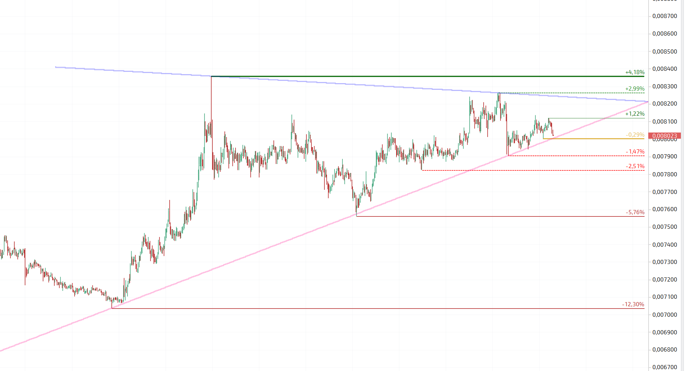
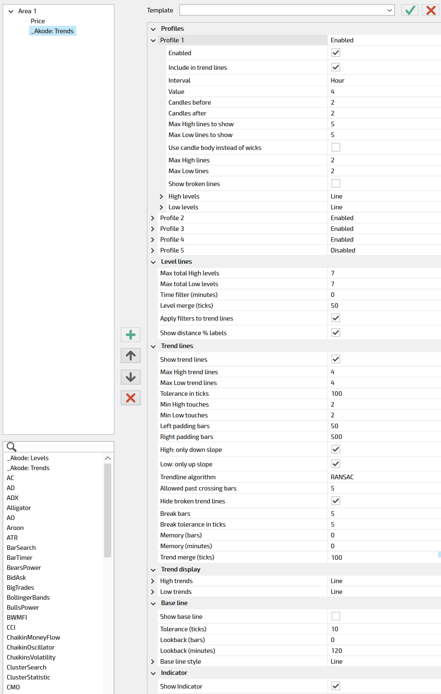

# Akode TigerTrade Indicators

[](https://github.com/akode-dev/akode-tigertrade/actions/workflows/ci.yml)
[](LICENSE)
[](https://dotnet.microsoft.com/)
[](https://www.tiger.com/terminal)

Open-source TigerTrade custom indicators repository.

This package is designed as a collection of indicators and will expand over time.

## Indicators

### Akode Levels (`AkodeLevelsIndicator`)

Pivot-based support/resistance level detector.

It detects pivot highs/lows and draws horizontal support and resistance levels.
It supports aggregation to higher intervals, tracks broken and tested (wick-pierced) levels, and limits visible lines independently for highs and lows.

#### Features

- Pivot-based support/resistance detection from chart highs and lows.
- Optional timeframe aggregation: Any, Minute, Hour, Week, Month.
- Configurable pivot sensitivity (`Candles before` / `Candles after`).
- Independent limits for visible high and low levels.
- Tested level detection — wick pierced the level but close held (separate style).
- Optional rendering of broken levels (close passed through) with dotted style.
- Round level highlighting with custom style for levels at round price numbers.
- Live percent-distance labels on the chart for nearest visible levels.
- Theme/template integration through TigerTrade indicator APIs.

See [docs/SETTINGS_LEVELS_RU.md](docs/SETTINGS_LEVELS_RU.md) for Russian documentation.

#### Settings

| Parameter | Default | Description |
| --- | --- | --- |
| Interval | Any Time Frame | Aggregation interval for pivot detection. |
| Value | 1 | Multiplier for selected interval. |
| Candles before | 2 | Bars to the left required for pivot confirmation. |
| Candles after | 2 | Bars to the right required for pivot confirmation. |
| Max High lines to show | 15 | Max active resistance levels displayed. |
| Max Low lines to show | 15 | Max active support levels displayed. |
| Show broken lines | true | Show levels where close passed through. |
| Max High lines (broken) | 2 | Max broken resistance levels displayed. |
| Max Low lines (broken) | 2 | Max broken support levels displayed. |
| Show tested lines | true | Show levels where wick pierced but close held. |
| Max High lines (tested) | 1 | Max tested resistance levels displayed. |
| Max Low lines (tested) | 1 | Max tested support levels displayed. |
| Tested High levels | Green dash | Style/color for tested resistance levels. |
| Tested Low levels | Red dash | Style/color for tested support levels. |
| High levels | Green line | Style/color for resistance levels. |
| Low levels | Red line | Style/color for support levels. |
| Show distance % labels | false | Draw live percent distance to nearest visible levels. |

#### Round Levels Settings

| Parameter | Default | Description |
| --- | --- | --- |
| Highlight round levels | false | Highlight levels on round price numbers with custom style. |
| Round step | 0 | Price step for round numbers. 0 = auto (tick size × 100). |
| Round tolerance (ticks) | 0 | Tolerance in ticks: levels near round numbers are treated as round. |
| Round High levels | Gold line (width 2) | Style/color for round resistance levels. |
| Round Low levels | Gold line (width 2) | Style/color for round support levels. |

### Akode Trends (`AkodeTrendsIndicator`)

Multi-profile support/resistance and trendline overlay.

Combines up to five independent level-detection profiles into one indicator with a shared trendline engine. Each profile works on its own timeframe and settings, while trendlines are built from the combined levels of all profiles.

#### Features

- Up to 5 independent internal profiles in one indicator instance.
- Per-profile timeframe, pivot sensitivity, body/wick mode, limits, broken/tested-level handling, and display styles.
- Per-profile toggle for trendline participation ("Include in trend lines").
- Tested level detection — wick pierced the level but close held (per-profile toggle).
- Horizontal levels rendered separately per profile with cross-profile global filters.
- Optional live percent-distance labels on the chart for the nearest visible support/resistance levels, with gap-to-next-level indicator (▲/▼).
- Confirmation dots: detects and marks retested levels with numbered dots, with mature-color signal when the retest holds.
- Round level highlighting with custom style for levels at round price numbers.
- Global level filters: max total lines, time-based filtering, and merge of nearby levels.
- Combined upper and lower trend rays built from filtered visible levels.
- Selectable trendline algorithms: Classic Touches, Weighted Regression, RANSAC, Hough Transform.
- Trendline memory to prevent redrawing for configurable bars/time.
- Trendline merge to deduplicate similar diagonal lines.
- Independent slope filters for upper and lower trendlines.
- Optional hiding of trendlines already broken by candle bodies.
- Theme/template integration through TigerTrade indicator APIs.

See [docs/SETTINGS_TRENDS_RU.md](docs/SETTINGS_TRENDS_RU.md) for Russian documentation.

#### Profile Settings (per profile)

| Parameter | Default | Description |
| --- | --- | --- |
| Enabled | Profile 1: true, others: false | Enable/disable the profile. |
| Include in trend lines | true | Include this profile's levels in trendline calculation. |
| Interval | Any Time Frame | Timeframe aggregation for pivot detection. |
| Value | 1 | Multiplier for selected interval. |
| Candles before | 2 | Bars to the left required for pivot confirmation. |
| Candles after | 2 | Bars to the right required for pivot confirmation. |
| Max High lines to show | 5 | Max active resistance levels for this profile. |
| Max Low lines to show | 5 | Max active support levels for this profile. |
| Use candle body instead of wicks | false | Use candle body (open/close) instead of wicks (high/low) for pivots. |
| Show broken lines | false | Show levels where close passed through. |
| Max High lines (broken) | 2 | Max broken resistance levels for this profile. |
| Max Low lines (broken) | 2 | Max broken support levels for this profile. |
| Show tested lines | true | Show levels where wick pierced but close held. |
| Max High lines (tested) | 1 | Max tested resistance levels for this profile. |
| Max Low lines (tested) | 1 | Max tested support levels for this profile. |
| High levels | Colored line | Style/color for resistance levels. |
| Low levels | Colored line | Style/color for support levels. |

#### Level Lines Settings (global)

| Parameter | Default | Description |
| --- | --- | --- |
| Max total High levels | 7 | Max total resistance levels across all profiles. 0 = unlimited. |
| Max total Low levels | 7 | Max total support levels across all profiles. 0 = unlimited. |
| Time filter (minutes) | 0 | Only show levels whose pivots occurred within the last N minutes. 0 = disabled. |
| Level merge (ticks) | 50 | Merge horizontal levels within N ticks of each other, keeping the strongest. 0 = disabled. |
| Apply filters to trend lines | true | Whether global level filters also affect trendline input. |
| Show distance % labels | true | Draw live percent distance to the nearest visible levels directly on the chart. |
| Distance % decimals | 1 | Decimal places in percent labels (1–4). |
| Distance label font size | 9 | Font size for the main distance label (e.g., +1.5%). |
| Distance label bold | false | Bold font for the distance label. |
| Gap label font size | 9 | Font size for the gap-to-next-level label (▲/▼). |
| Gap label bold | false | Bold font for the gap label. |

Each visible level shows its distance from the current price (e.g., `+1.5%`). If another visible level exists further away, a second label shows the gap to it with a triangle: `▲0.8%` for resistance, `▼0.8%` for support.

#### Round Levels Settings

| Parameter | Default | Description |
| --- | --- | --- |
| Highlight round levels | false | Highlight levels on round price numbers with custom style. |
| Round step | 0 | Price step for round numbers. 0 = auto (tick size × 100). |
| Round tolerance (ticks) | 0 | Tolerance in ticks: levels near round numbers are treated as round. |
| Round High levels | Gold line (width 2) | Style/color for round resistance levels. |
| Round Low levels | Gold line (width 2) | Style/color for round support levels. |

#### Tested Display

| Parameter | Default | Description |
| --- | --- | --- |
| Tested High levels | Green dash | Style/color for tested resistance levels. |
| Tested Low levels | Red dash | Style/color for tested support levels. |

#### Confirmation Dots

Visually marks levels that have been retested. The indicator places two dots on the horizontal level line:

- **Dot 1** — the bar where the level was formed (pivot).
- **Dot 2** — the bar where price approached the level closest without breaking through.

After enough bars pass since dot 2, it turns green (configurable), signaling the level is confirmed and holding.

| Parameter | Default | Description |
| --- | --- | --- |
| Show confirmation dots | false | Toggle confirmation dot display. |
| Tolerance (x0.1%) | 5 | Approach tolerance. Value 5 = 0.5%, 10 = 1.0%. Price must approach the level within tolerance but not cross it (even by wick). |
| Min bars between touches | 10 | Minimum candles between dot 1 and dot 2. |
| Timeframe (minutes, 0=chart) | 0 | Dedicated timeframe for dot calculation (in minutes). 0 = use chart timeframe. Useful to keep dots stable when switching to lower timeframes. |
| Dot size | 6 | Dot diameter in pixels. |
| Dot color | Cyan | Color for dot 1 and dot 2 while it is fresh. |
| Mature after bars | 5 | Bars after dot 2 before it changes color. |
| Mature dot color | Green | Color for dot 2 once it has matured — signals a confirmed level. |

#### Trend Lines Settings

| Parameter | Default | Description |
| --- | --- | --- |
| Show trend lines | true | Toggle shared trendline rendering. |
| Max High trend lines | 4 | Max upper trend rays displayed. |
| Max Low trend lines | 4 | Max lower trend rays displayed. |
| Tolerance in ticks | 100 | Touch tolerance used when scoring trendlines. |
| Min High touches | 2 | Minimum touches required for upper trendlines. |
| Min Low touches | 2 | Minimum touches required for lower trendlines. |
| Left padding bars | 50 | Extend trendlines to the left of the first touch. |
| Right padding bars | 500 | Extend trendlines into the empty chart area to the right. |
| High: only down slope | true | Restrict upper trendlines to descending slope. |
| Low: only up slope | true | Restrict lower trendlines to ascending slope. |
| Trendline algorithm | RANSAC | Algorithm for trendline candidates: Classic Touches, Weighted Regression, RANSAC, Hough Transform. |
| Allowed past crossing bars | 5 | Allow upper/lower intersections only within the last N bars. |
| Hide broken trend lines | true | Hide trendlines already broken by candle bodies. |
| Break bars | 5 | Body-break bars after the first anchor required to hide a trendline. |
| Break tolerance in ticks | 5 | Extra tolerance beyond the trendline before a body-break counts. |
| Memory (bars) | 0 | Lock trendlines for N new bars to prevent redrawing. 0 = disabled. |
| Memory (minutes) | 0 | Lock trendlines for N minutes to prevent redrawing. 0 = disabled. |
| Trend merge (ticks) | 100 | Merge similar diagonal trendlines within N ticks distance. 0 = disabled. |
| High trends | Gray line | Style/color for upper trend rays. |
| Low trends | Gray line | Style/color for lower trend rays. |

More indicators can be added to this package over time.

## Screenshots

| Indicator | Preview |
| --- | --- |
| Akode Levels |  |
| Akode Trends |   |

## Requirements

- Windows with TigerTrade installed (tested against `6.9+`).
- .NET Framework 4.7.2 targeting pack.
- Visual Studio 2022 `17.13+` or .NET SDK `9.0.200+` (required for `.slnx` support).
- Local TigerTrade DLLs placed in `libs/` (see [libs/README.md](libs/README.md)).

## Quick Start

### For Developers (build from source)

1. Copy TigerTrade DLL dependencies into `libs/`:

```powershell
.\scripts\setup-libs.ps1
```

2. Build:

```powershell
msbuild Akode.TigerTrade.slnx /p:Configuration=Release /p:Platform="Any CPU"
```

If `msbuild` is not available in `PATH`, use:

```powershell
dotnet msbuild Akode.TigerTrade.slnx /p:Configuration=Release /p:Platform="Any CPU"
```

3. Deploy to TigerTrade:

```powershell
.\scripts\deploy.ps1
```

4. Restart TigerTrade and add **_Akode: Levels** or **_Akode: Trends** to chart.

### Manual Install (pre-built DLL)

1. Download `Akode.TigerTrade.Indicators.dll` from [Releases](../../releases).
2. Copy the DLL to:

```text
%USERPROFILE%\Documents\TigerTrade\Indicators\
```

3. Restart TigerTrade and add **_Akode: Levels** or **_Akode: Trends** to chart.

## Releasing on GitHub

Releases are automated via GitHub Actions. Push a version tag to trigger a build and release:

```powershell
git tag -a v1.3.0 -m "Release v1.3.0"
git push origin v1.3.0
```

The [Release workflow](.github/workflows/release.yml) will:
1. Build the DLL in Release configuration.
2. Stamp the assembly version from the tag.
3. Generate a SHA256 checksum.
4. Create a GitHub Release with the DLL and checksum attached.

Pre-release tags (e.g., `v1.3.0-beta.1`) are automatically marked as prerelease.

To create a release locally instead, use the helper script:

```powershell
.\scripts\release-gh.ps1 -Version "1.3.0"
```

## Project Structure

```text
.
|- .github/
|- docs/
|  |- images/
|  \- ARCHITECTURE.md
|- libs/
|- scripts/
|- src/
|  \- Akode.TigerTrade.Indicators/
|     |- AkodeTrendsIndicator.cs
|     |- AkodeTrendsProfileSettings.cs
|     |- AkodeLevelsIndicator.cs
|     |- Helpers/
|     |- Properties/
|     \- Akode.TigerTrade.Indicators.csproj
|- Akode.TigerTrade.slnx
|- CHANGELOG.md
|- CONTRIBUTING.md
|- CODE_OF_CONDUCT.md
\- LICENSE
```

## Build Output

Release assembly path:

`src/Akode.TigerTrade.Indicators/bin/Release/Akode.TigerTrade.Indicators.dll`

## Contributing

See [CONTRIBUTING.md](CONTRIBUTING.md) for development workflow, coding standards, and PR expectations.

## License

MIT License. See [LICENSE](LICENSE).

## Disclaimer

This software is provided "as is", without warranty of any kind, express or implied. The author assumes no responsibility or liability for any errors, bugs, data loss, financial loss, or any other damages arising from the use of this software. Use at your own risk.

Tiger Trade is a product of Tiger Trade Capital AG. This repository is independent and not affiliated with Tiger Trade Capital AG.
